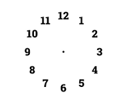

# Analog Clock

A responsive analog clock built with plain HTML, CSS and JavaScript, with a light/dark mode toggle.

**Live demo:** https://muhammadmuheb.github.io/Clock/



## Features

- Real-time analog clock (hour, minute and second hands) driven by pure CSS transforms
- Light / dark mode toggle, persisted in `localStorage`
- Fully responsive: the clock scales fluidly with `clamp()` and `vmin` units, so it fits
  correctly on any screen size or orientation (including short/landscape mobile viewports)
  instead of relying on a fixed set of breakpoints
- No build step, no dependencies

## Running locally

This is a static site — just open `index.html` in a browser, or serve the folder:

```bash
npx serve .
```

## Deployment

The site deploys automatically to GitHub Pages via the workflow in
[`.github/workflows/deploy.yml`](.github/workflows/deploy.yml) on every push to `main`:

1. Checks out the repo
2. Validates the HTML
3. Uploads the site as a Pages artifact
4. Deploys it to the `github-pages` environment

In the repo settings, **Settings → Pages → Build and deployment → Source** must be set to
**GitHub Actions** for this workflow to publish the site.

## Credits

Original clock markup/styles by [CodingNepal](https://codingnepalweb.com).
